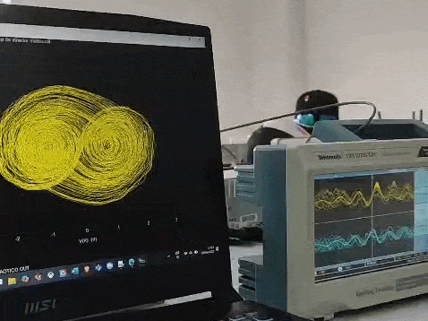
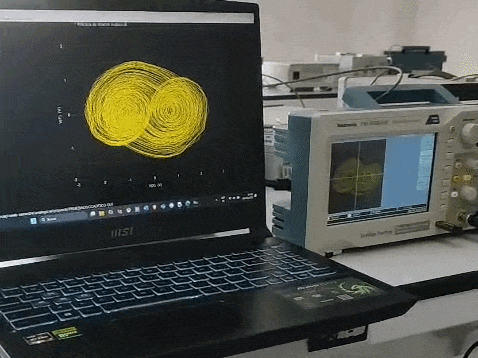
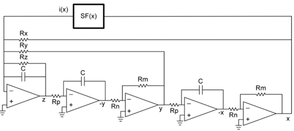
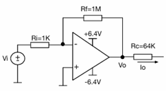
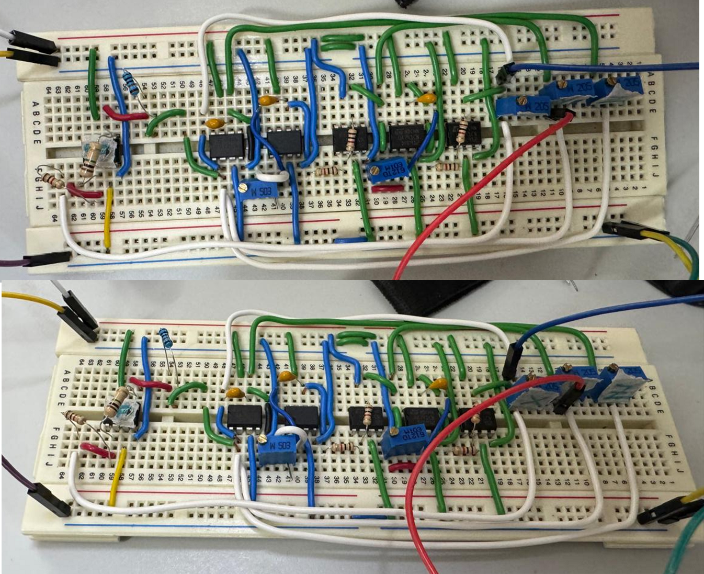
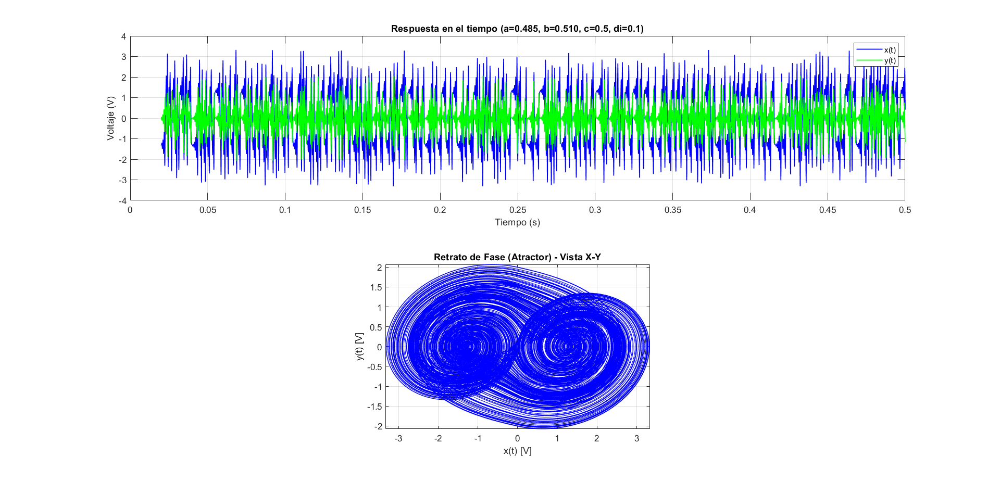
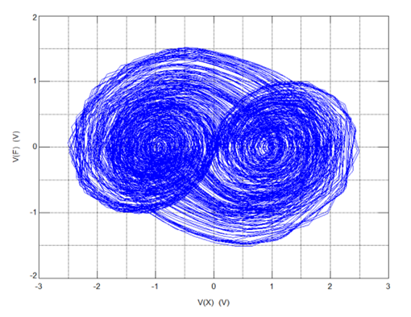
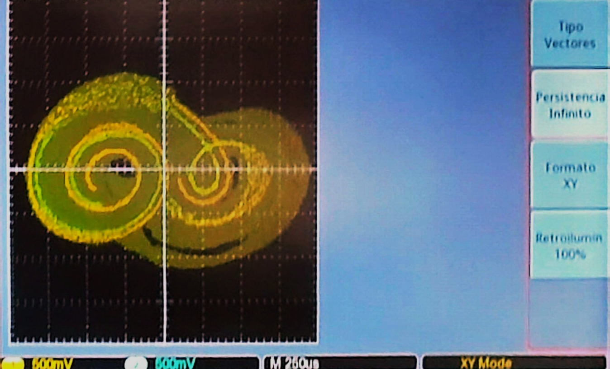
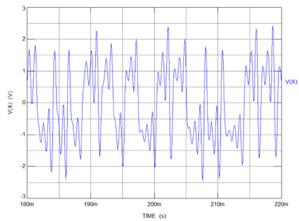
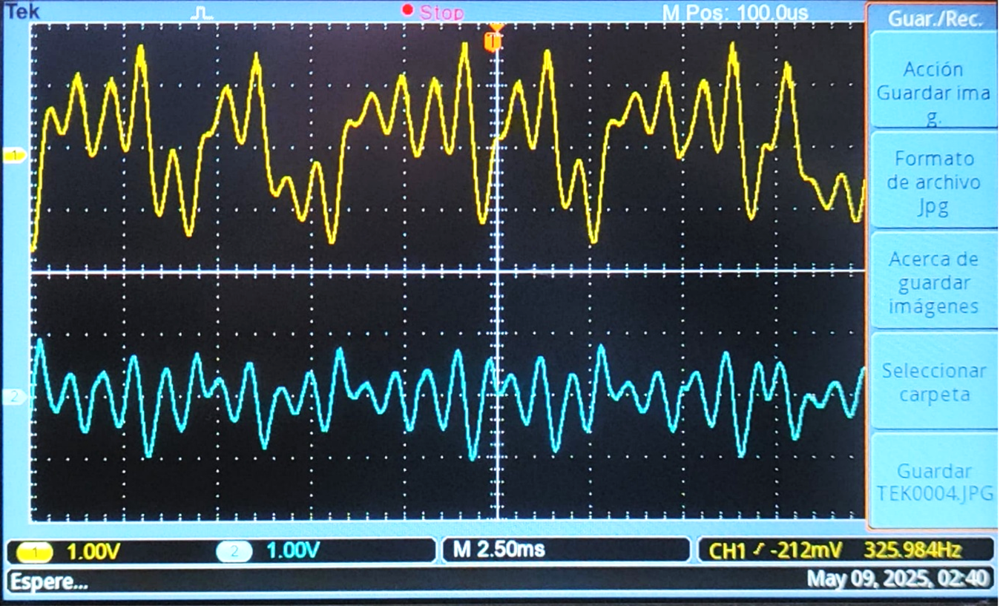

# Lu Chen Multiscroll Chaotic Oscillator

<div align="center">
  
  
  
</div>

<br>

## 📖 Description
A comprehensive analog engineering project focused on the design, simulation, and physical implementation of a Lu Chen multiscroll chaotic oscillator. Chaotic systems are widely studied in electronics for their potential in secure communications, random number generation, and modeling of non-linear phenomena.

This repository documents the entire engineering cycle: from mathematical modeling and numerical verification in MATLAB, to SPICE circuit simulation, culminating in a functional hardware prototype using commercial Operational Amplifiers. The implementation successfully generates complex chaotic trajectories with multiple lobes (scrolls) depending on the introduced non-linearity.

<div align="center">
  <table>
    <tr>
      <td align="center"><b>Time-Domain Response</b><br></td>
      <td align="center"><b>Phase Portrait (X-Y Mode)</b><br></td>
    </tr>
  </table>
  <p><i>Multiscroll chaotic attractor physically generated and captured in real-time on the oscilloscope.</i></p>
</div>

## 🧮 Theoretical Foundation: State Equations & Non-Linearity

The core of this oscillator is governed by a system of three coupled first-order ordinary differential equations:

$$\frac{dx}{dt} = y$$
$$\frac{dy}{dt} = z$$
$$\frac{dz}{dt} = -ax - by - cz + d_i f(x)$$

### Analog Mixed-Mode Processing
The circuit is synthesized using an architecture of three cascaded integrators with negative feedback. To solve the differential equations, the circuit employs mixed-mode processing, specifically utilizing current summation at the main operational amplifier node ($\sum I_{in} = \sum I_{out}$).

The parameters $a, b, c$, and $d_i$ are defined by the ratio of the base integration impedance to the corresponding feedback resistor:
* $a \approx 0.485$ (Set by **20.6 kΩ**)
* $b \approx 0.51$ (Set by **19.61 kΩ**)
* $c = 0.5$ (Set by **20 kΩ**)
* $d_i = 0.1$ (Set by **100 kΩ**)

### The Non-Linear Function $f(x)$
The multiscroll behavior requires a non-linear bounding function. This is achieved using the hyperbolic tangent function ($\tanh$). In the hardware, this is approximated by heavily saturating an operational amplifier configured with a specific gain and diode feedback, clipping the output near the supply rails.

### Time Scaling ($\tau$)
Mathematical models of chaos operate in dimensionless time, which is typically too slow for real-world oscilloscope visualization. To bridge this gap, a time constant ($\tau$) was introduced:

$$\tau = R_0 C_0$$

Using $R_0 =$ **10 kΩ** and $C_0 =$ **10 nF**, we obtain $\tau =$ **0.1 ms**. This hardware scaling accelerates the mathematical model by a factor of 10,000, allowing the attractor to be viewed fluidly in real-time.

## Hardware Schematics

To replicate the physical circuit, the system is divided into the main integrator cascade and the non-linear saturation block.

<div align="center">
  <table>
    <tr>
      <td align="center"><b>Main Oscillator Circuit</b><br></td>
      <td align="center"><b>Non-Linear Function Block S<sub>F</sub>(x)</b><br></td>
    </tr>
  </table>
</div>

## Physical Implementation & BOM

<div align="center">
  
  <p><i>The complete analog circuit implemented on a breadboard.</i></p>
</div>

| Component | Value/Part | Quantity | Description |
| :--- | :--- | :--- | :--- |
| **OpAmp** | TL081 | 6 | High-speed JFET-input operational amplifiers. |
| **Capacitor** | **10 nF** | 3 | Used in the three integration stages. |
| **Resistor** | **10 kΩ** | 7 | Base resistors for integration and inversion. |
| **Resistor** | **19.61 kΩ** | 1 | Feedback resistor (parameter $b$). |
| **Resistor** | **20 kΩ** | 1 | Feedback resistor (parameter $c$). |
| **Resistor** | **20.6 kΩ** | 1 | Feedback resistor (parameter $a$). |
| **Resistor** | **64 kΩ**, **100 kΩ**, **1 MΩ**, **981 Ω** | 1 each | Gain and scaling for the $\tanh$ saturation stage. |
| **Power Supply**| **±6.4V** | 1 | Symmetrical dual power supply for the OpAmps. |

## 📊 Analytical Verification: MATLAB vs. SPICE vs. Reality

The true success of an analog design lies in verifying that the physical implementation strictly follows the mathematical model. 

### Phase Portrait (X-Y Mode)
Comparing the theoretical attractor shape against the simulated electronics and the real hardware response:

<div align="center">
  <table>
    <tr>
      <td align="center"><b>MATLAB (Numerical)</b><br></td>
      <td align="center"><b>TopSpice (Netlist)</b><br></td>
      <td align="center"><b>Oscilloscope (Hardware)</b><br></td>
    </tr>
  </table>
</div>

### Time-Domain Response ($x(t)$ & y(t))
Analyzing the chaotic oscillation amplitude and frequencies over time:

<div align="center">
  <table>
    <tr>
      <td align="center"><b>TopSpice Simulation</b><br></td>
      <td align="center"><b>Hardware Oscilloscope</b><br></td>
    </tr>
  </table>
</div>

## 📁 Repository Structure

```text
analog-chaotic-multiscroll-oscillator/
│
├── docs/                      # Documentation and mathematical proofs
│   └── ANALOGICOS-REPORTE_OSCILADOR_CAOTICO.pdf
│
├── matlab/                    # Numerical simulation scripts
│   └── chaos.m                # ode45 solver with time-scaled parameters
│
├── media/                     # Schematics, results, and photos
│   ├── circuit.png            # Physical breadboard implementation
│   ├── schematic.png          # Full analog circuit schematic
│   ├── oscillator.gif         # Real oscillator functioning
│   └── ...                    # Oscilloscope captures and plots
│
├── spice_simulations/         # Circuit simulation files
│   └── chaos.cir              # TopSpice Netlist
│
├── .gitignore                 # Excludes heavy binary SPICE outputs
└── README.md                  # This documentation file
```

## 🚀 Getting Started

1. Clone this repository to your local machine:
   ```bash
   git clone https://github.com/NablaCheese505/analog-chaotic-multiscroll-oscillator.git
   ```
2. **For MATLAB Simulation:** Open `/matlab/chaos.m` and run it to observe the numerical resolution of the scaled differential equations.
3. **For SPICE Simulation:** Open `/spice_simulations/chaos.cir` using TopSpice (or any compatible SPICE engine). The `.cir` file includes `#AUTOPLOT` directives to automatically generate the Bode and transient response graphs upon execution.

## 👨‍💻 Author
**Martín Farid Carrasco Gómez** Mechatronics Engineering Student